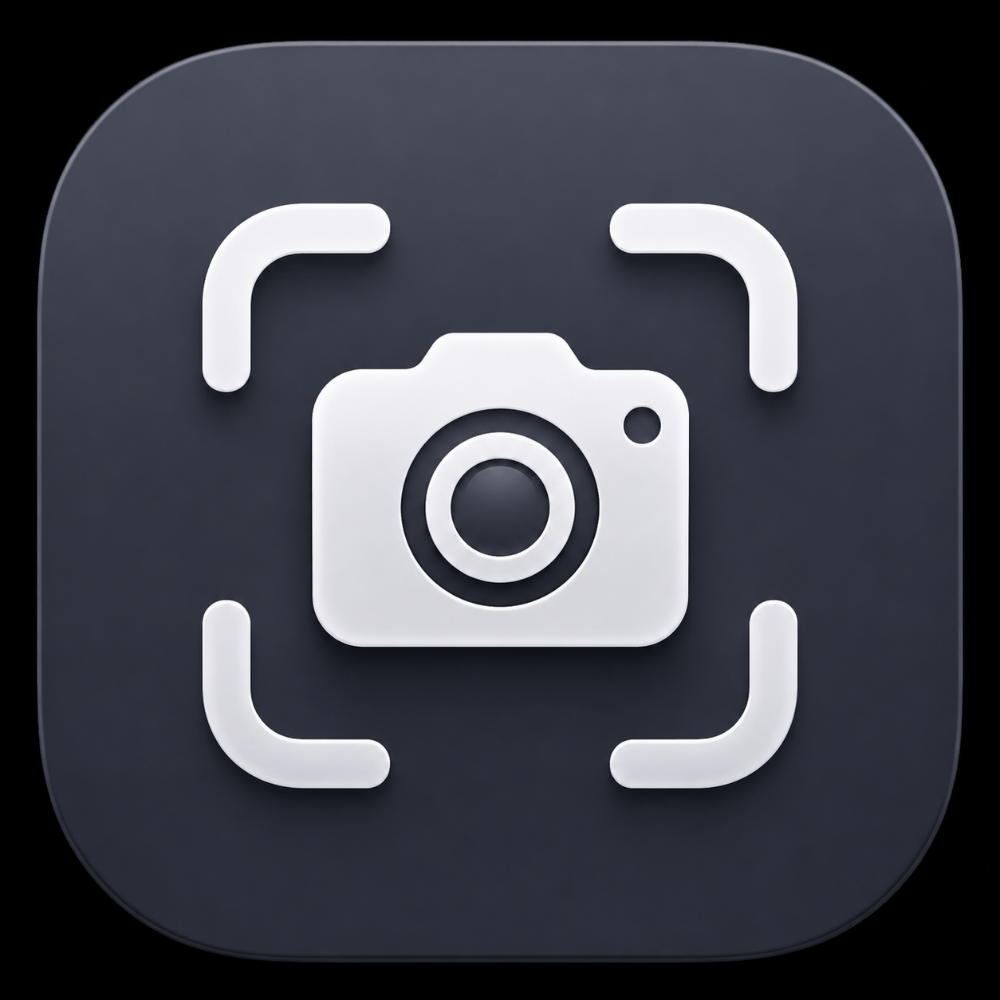

<p align="center">
  
</p>

<h1 align="center">ClaudeShot</h1>

<p align="center">
  <strong>最前面のウィンドウをキャプチャして、そのまま Claude に貼り付ける — ショートカット一発で動く macOS メニューバーアプリ。</strong>
</p>

<p align="center">
  <a href="README.md">English</a> · <strong>日本語</strong>
</p>

<p align="center">
  <a href="https://developer.apple.com/swift/"></a>
  <a href="https://www.apple.com/macos/"></a>
  <a href="#-ライセンス"></a>
  <a href="#"></a>
  <a href="#"></a>
</p>

<p align="center">
  <a href="#-概要">概要</a> •
  <a href="#-主な機能">主な機能</a> •
  <a href="#%EF%B8%8F-仕組み">仕組み</a> •
  <a href="#-デモ">デモ</a> •
  <a href="#-インストール">インストール</a> •
  <a href="#-権限">権限</a> •
  <a href="#%EF%B8%8F-既知の制限">既知の制限</a> •
  <a href="#%EF%B8%8F-開発">開発</a> •
  <a href="#-ライセンス">ライセンス</a>
</p>

---

## 📖 概要

**ClaudeShot** は、Agent Swarm の **Appshot** キャプチャ機能を移植し、**Claude デスクトップアプリ**（`com.anthropic.claudefordesktop`）に繋ぎ込んだツールです。バックグラウンドの**メニューバー常駐アプリ**として動作します — Dock アイコンなし、フットプリント極小、外部依存ゼロ。

グローバルショートカット（デフォルトは **⇧⌘1** — 自分で好きなキーに変更も可）を Mac のどこで押しても、ClaudeShot が **ScreenCaptureKit** で**最前面のウィンドウ**をキャプチャし、フラッシュ → 着地 → 整う のアニメーションを再生、PNG をクリップボードにコピーしてから Claude を前面に出し、入力欄に **⌘V** を送ります。キーを離す前にはもうスクショが Claude に届いています。

アクセシビリティ許可がない場合は貼り付け処理だけスキップされます — 画像はクリップボードに残っているので、Claude の入力欄をクリックして自分で ⌘V を押すだけです。

---

## 🎬 デモ

[](https://youtu.be/eiGT74FJkao)

▶ **[デモ動画を見る（30秒）](https://youtu.be/eiGT74FJkao)** — ショートカット一発で Safari・Finder・システム設定・メモ・ターミナルの各ウィンドウをキャプチャし、そのまま Claude に貼り付けます。

---

## ✨ 主な機能

### ⌨️ グローバルショートカットでキャプチャ
- システム全体で効く Carbon 製ショートカット。ClaudeShot がフォーカスされていなくても、**どのアプリからでも**発火します。
- デフォルト **⇧⌘1**。プリセットとして **⇧⌘2**・**⇧⌘A**・**⌥⌘A**・**⌃⌥C** を用意。または **「ショートカットを記録…」** を押して、好きな組み合わせを自分で登録できます（誤爆防止のため ⌘/⌃/⌥ のいずれかが必須。Esc でキャンセル）。設定は再起動後も保持されます。
- マウスだけで使えるよう、メニュー項目（**アプリショットを撮る**）からも実行できます。

### 📸 最前面ウィンドウのスクリーンショット
- **ScreenCaptureKit** を使い、**最前面のウィンドウ**を Retina 解像度でキャプチャします。
- 送信先が正しいウィンドウになるよう、ソース情報（アプリ名・ウィンドウタイトル・バンドル ID・PID）を記録します。
- PNG はキャプチャ用ディレクトリに書き出され、**同時に**システムのクリップボードにも入ります。

### 🤖 Claude への貼り付け
- Claude デスクトップアプリを自動で前面化し、入力欄にフォーカスして **⌘V** を代わりに押します。
- バックグラウンドからでも動作 — 対象が前面に来なかった場合は、**Claude のプロセス ID に直接**貼り付けを送るので、見当違いのアプリに貼られる事故を防ぎます。
- アクセシビリティ許可がなければ、画像はクリップボードに残るだけ — 手動で貼り付けられます。

### 🎬 アニメーション付きのキャプチャ演出
- フローティングのオーバーレイパネルが **フラッシュ → 着地 → 整う → 完了** の 4 段階ステートマシンを駆動します。
- リキッドグラス調のオーバーレイと、カメラのシャッターのようなフラッシュ。
- 設定の *速い ⇄ 滑らか* スライダーで**フラッシュの速さ**を調整できます。

### 🔊 キャプチャ音を選べる
- 撮影時の音（例：**Pop**）を選ぶか、完全にオフにできます。選択は記憶されます。

### 🌐 日英バイリンガル UI
- **English / 日本語**に完全対応。設定からその場で切り替わります。

### 🧊 ネイティブなメニューバー UI
- `camera.viewfinder` の SF Symbol でメニューバーに常駐 — `LSUIElement` アクセサリとして動作し、Dock には出ません。
- ショートカット・音・フラッシュ・言語・各種権限をまとめたグラス調の設定画面。

---

## ⚙️ 仕組み

SwiftUI 製のメニューバーアプリが、キャプチャから貼り付けまでを macOS のネイティブ API だけで完結させます。

```
[ グローバルショートカット ⇧⌘1 ]  ──または──  [ メニュー ▸ アプリショットを撮る ]
       │
       ├─► [1] 最前面ウィンドウを特定（ScreenCaptureKit ＋ ソース情報）
       ├─► [2] フラッシュ演出 → Retina 解像度でキャプチャ → PNG
       ├─► [3] PNG をシステムのクリップボードにコピー
       ├─► [4] Claude を前面化（com.anthropic.claudefordesktop）＋ 入力欄にフォーカス
       ├─► [5] ⌘V を送信（前面化できなければ Claude の PID に直接送信）
       └─► [6] 着地 → 整う → 完了 のオーバーレイアニメ ＋ キャプチャ音
```

| 部品 | ファイル |
|---|---|
| メニューバーアプリ ＋ ショートカット配線 | `Sources/ClaudeShot/App/ClaudeShotApp.swift` |
| キャプチャエンジン ＋ フェーズ管理 | `Sources/ClaudeShot/Services/AppshotController.swift` |
| Claude への貼り付け処理 | `Sources/ClaudeShot/Services/ClaudeInjector.swift` |
| グローバルショートカット（Carbon） | `Sources/ClaudeShot/Services/GlobalHotKeyController.swift` |
| キャプチャ演出 | `Sources/ClaudeShot/Views/AppshotVisuals.swift` |
| フローティングオーバーレイ | `Sources/ClaudeShot/Views/CapturePanel.swift` ＋ `CaptureOverlayView.swift` |
| 設定（ショートカット / 音 / 権限） | `Sources/ClaudeShot/Views/PreferencesView.swift` |

---

## 🚀 インストール

### 1. リポジトリをクローン
```bash
git clone https://github.com/MohamedFuad16/ClaudeShot.git
cd ClaudeShot
```

### 2. ビルド・署名・起動
```bash
./script/build_and_run.sh          # .app をビルド → 署名 → /Applications にインストール → 起動
```

このスクリプトは SwiftPM でビルドし、バイナリを正式な `.app` バンドルに包み（権限がバンドル ID `com.mfuad.ClaudeShot` に紐づくように）、アドホック署名して `/Applications` にインストールし、メニューバーアプリとして起動します。メニューバーの**カメラアイコン**を探してください。

### 3. そのほかのモード
```bash
./script/build_and_run.sh build    # ビルド＋インストールのみ（起動しない）
./script/build_and_run.sh verify   # ビルド＋起動＋プロセス起動確認
./script/build_and_run.sh logs     # ビルド＋起動＋統合ログをストリーム表示
```

> **署名について：** キーチェーンに `Apple Development` / `Developer ID` の署名 ID があれば自動で使用します（この場合、再ビルドしても権限は保持されます）。無い場合はアドホック署名にフォールバックするため、再ビルドのたびに画面収録／アクセシビリティ許可の再付与が必要になることがあります。`CLAUDESHOT_SIGN_IDENTITY` で上書き可能です。

**macOS 14 以降**と Swift ツールチェイン（Xcode または Command Line Tools）が必要です。

---

## 🔐 権限

ClaudeShot には macOS のプライバシー権限が 2 つ必要です。どちらもメニューまたは設定から付与できます。

1. **画面収録** — ウィンドウのキャプチャに使用。最初のアプリショット時に要求されます。
2. **アクセシビリティ** — 代わりに Claude へ ⌘V を押すために使用。メニューの **「アクセシビリティ許可を付与…」** または設定画面から付与してください。

正式に署名された `.app` バンドルを `/Applications` にインストールするため、（署名 ID がある場合）両方の権限は再ビルド後もバンドル ID `com.mfuad.ClaudeShot` に紐づいたまま保持されます。一時ディレクトリのアプリはプライバシー一覧に追加できない — だからこそビルドスクリプトは `/Applications` にインストールします。

---

## ⚠️ 既知の制限

まだ詰めきれていない点を 2 つ、正直に書いておきます。

1. **入力欄が未フォーカスだと貼り付けに失敗することがある。** Claude の入力欄を一度もクリックしていない状態で、別のアプリからショートカットを叩くと、スクショは撮れても入力欄に届かないことがあります。Claude デスクトップは Electron/Chromium 製で、アクセシビリティツリーを遅延生成し、プログラムからのフォーカス指定を無視しがちなため、合成した ⌘V が宙に浮くことがあるのです。ClaudeShot は AX でウィンドウを前面化 → 入力欄を実クリック → Claude の PID に直接 ⌘V、という多段構えで対処していますが、まだ 100% ではありません。フォールバックとして画像は必ずクリップボードに残ります。
2. **Claude の「1 メッセージ 5 枚まで」制限。** Claude デスクトップは 1 メッセージにつき画像**5 枚**までしか受け付けません。それを超えると、ClaudeShot はキャプチャしてサムネイル（右下）は表示するものの、画像は**クリップボード**に入るだけになります — ⌘V で手動貼り付けしてください。枚数を意識した処理は今後対応予定です。

📝 **解説記事：** ClaudeShot を作った経緯と、Appshot のアニメーションを解析するために使った小技（**動画のフレーム**を Claude に読ませる裏技）は [`docs/qiita-article.ja.md`](docs/qiita-article.ja.md) にまとめています。

---

## 🛠️ 開発

**外部依存ゼロ**で Swift だけで作られています — CocoaPods なし、サードパーティの SPM パッケージなし、SwiftPM でコンパイルする Apple フレームワークのみ。

| | |
|---|---|
| **言語** | Swift 5.10+ |
| **UI** | SwiftUI（`MenuBarExtra`、グラス調の設定画面） |
| **フレームワーク** | ScreenCaptureKit、AppKit、Carbon（ショートカット） |
| **ビルド** | SwiftPM（`swift build -c release`） |
| **最小 OS** | macOS 14.0（Sonoma） |
| **依存関係** | なし |
| **動作形態** | メニューバーアプリ（`LSUIElement`、Dock アイコンなし） |

### プロジェクト構成
```
Sources/ClaudeShot/
├── App/
│   ├── ClaudeShotApp.swift         — MenuBarExtra アプリ、ショートカット配線、メニュー
│   └── SettingsPresenter.swift     — 設定ウィンドウの表示
├── Services/
│   ├── AppshotController.swift     — キャプチャ処理 ＋ flash→ready のフェーズ管理
│   ├── ClaudeInjector.swift        — クリップボード ＋ Claude 前面化 ＋ ⌘V 合成
│   ├── GlobalHotKeyController.swift — システム全体の Carbon ショートカット登録
│   ├── AppSettings.swift           — 送信先・音・フラッシュ速度の永続化
│   ├── PermissionsModel.swift      — 画面収録 / アクセシビリティの状態
│   └── Localization.swift          — English / 日本語 の文字列
├── Models/
│   └── AppshotModels.swift         — ソース情報、ショートカットのプリセット
└── Views/
    ├── PreferencesView.swift       — ショートカット・音・フラッシュ・言語・権限
    ├── HotKeyRecorderButton.swift  — 「ショートカットを記録…」のキー入力キャプチャ
    ├── AppshotVisuals.swift        — キャプチャ演出
    ├── CapturePanel.swift          — フローティングオーバーレイ
    ├── CaptureOverlayView.swift    — オーバーレイの描画
    └── GlassSupport.swift          — リキッドグラス用ヘルパー

script/build_and_run.sh            — ビルド → バンドル → 署名 → /Applications → 起動
Package.swift                      — SwiftPM マニフェスト（macOS 14、実行ファイルターゲット）
```

---

## 📝 ライセンス

本プロジェクトは MIT ライセンスで公開されています。

Developed with ❤️ by **[MohamedFuad16](https://github.com/MohamedFuad16)**. Issue や Pull Request はいつでも歓迎します！
