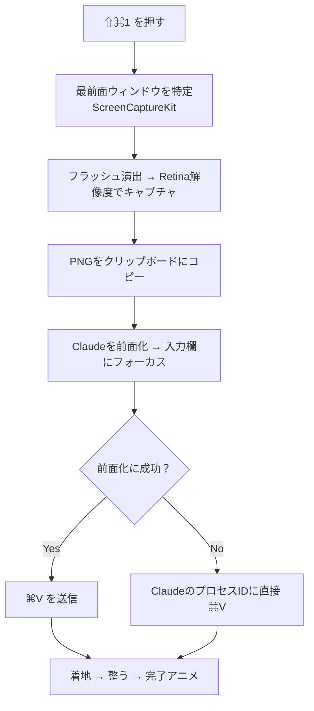

<!--
─────────────────────────────────────────────────────────────
📌 Qiita 投稿メモ（記事本文ではありません。投稿時に消してOK）

■ タイトル候補（本命 → サブ）
  1. 📸 CodexのAppshotが便利すぎたので、Claude用にメニューバーアプリを作った話   ← 本命
  2. 「Claude版Appshotが無いなら作るか」でメニューバー常駐アプリを作ってみた
  3. ブラウザもDockも開かず、Claudeをメニューバーから叩けるようにした話

■ タグ（5つ全部埋める）: SwiftUI  macOS  個人開発  ClaudeCode  生成AI
■ 投稿タイミング: 月曜 7:00〜8:00 JST。投稿後2時間以内に X でシェア → 10いいねを早めに突破
■ リポジトリリンクは冒頭と末尾の2箇所に。⭐️CTA を忘れずに
■ 冒頭に動作GIF（images/demo.gif）を必ず置く。文章より効く
─────────────────────────────────────────────────────────────
-->

# 📸 CodexのAppshotが便利すぎたので、Claude用にメニューバーアプリを作った話

## きっかけ

きっかけは、本当に些細なことでした。

Codexを使っていたころ、**Appshot** っていう機能をよく使っていたんです。ショートカット一発で、いま見ているウィンドウをそのままAIに渡せるやつ。スクショを撮って、保存先を探して、チャットにドラッグして……という一連の動作が、まるっと消える。一度これに慣れると、無い環境に戻ったときの面倒くささが尋常じゃない。

で、最近メインをClaudeのデスクトップアプリに移しました。動作も好みだし満足なんですが、ひとつだけ。**Appshotが無い。**

当然です。Appshotは僕がClaudeに求めていいものじゃない。でも、毎回スクショを撮ってドラッグして貼る、あの原始的な作業に逆戻りするのは、どうにも我慢できませんでした。

ないなら作るか。そんな軽いノリで作りました。**ClaudeShot** です。

> ⚠️ 先に断っておくと、これは Anthropic 公式ではありません。個人が趣味で作った、Claudeデスクトップアプリの外付けヘルパーです（完全に自分用に作ったやつを、せっかくなので公開しています）。

- **リポジトリ**： https://github.com/MohamedFuad16/ClaudeShot

---

## 何ができるのか

やることは拍子抜けするくらいシンプルです。

1. どのアプリを開いていても **⇧⌘1** を押す
2. 最前面のウィンドウが「パシャッ」とキャプチャされる
3. Claudeが前に出てきて、入力欄にスクショがもう貼られている

これだけ。手はほぼ動かしません。メニューバーにカメラのアイコンが常駐して、Dockには出てこない、完全な裏方アプリです。


*↑ 実際の動き。ここに動作GIFを差し込む*

---

## 動作環境

| | |
|---|---|
| OS | macOS 14 (Sonoma) 以降 |
| 言語 / UI | Swift 5.10・SwiftUI |
| 主なフレームワーク | ScreenCaptureKit / AppKit / Carbon |
| 依存ライブラリ | なし |

ビルドは `./script/build_and_run.sh` 一発。`.app`を作って署名して`/Applications`に入れて起動まで、全部これがやってくれます。

---

## なぜメニューバーアプリなのか

最初は「Claudeの中に組み込めないかな」と考えて、実際に中身（Electronアプリです）を覗いてみました。でも、`app.asar`はハッシュで整合性チェックされていて、少しでもいじると起動しなくなる。署名も当然Anthropicのもの。**中に手を入れるのは、現実的じゃなかった。**

なので発想を変えて、「外から、クリップボードとアクセシビリティ経由で貼り付ける」常駐アプリにしました。結果的にこれが正解で、Claudeがアップデートされても壊れません。

---

## 実装のポイント

### メニューバー常駐は `MenuBarExtra` で

SwiftUIの`MenuBarExtra`を使えば、常駐アプリの土台は驚くほど短く書けます。

```swift:ClaudeShotApp.swift
@main
struct ClaudeShotApp: App {
    var body: some Scene {
        MenuBarExtra("ClaudeShot", systemImage: "camera.viewfinder") {
            Button("アプリショットを撮る") { ClaudeShotRuntime.capture() }
                .keyboardShortcut(menuShortcut)   // 登録中のショートカットを反映
            // …設定・終了など省略
        }
        Settings { PreferencesView(/* … */) }
    }
}
```

あとは`AppDelegate`で`NSApp.setActivationPolicy(.accessory)`にすればDockアイコンが消えて、完全な裏方になります。グローバルショートカット自体はCarbonの`RegisterEventHotKey`で拾っています。

### ショートカットは好きなキーを登録できる

デフォルトは当初 **⇧⌘2** にしていたんですが、これ環境によって他とぶつかるんですよね。なので **⇧⌘1** に変えつつ、「設定画面で好きなキーを自分で記録できる」ようにしました。押したキーをそのまま読んで登録するだけ。ただし修飾キー（⌘/⌃/⌥）必須にしています。じゃないと、文字を打っただけで発火して大惨事になるので。

---

## いちばんハマったところ：フラッシュの長さがバラバラになる

ここが正直、いちばん時間を溶かしたところです。そして、いちばん学びがあった。

キャプチャ時に画面が「パシャッ」と光る演出をつけたんですが、テストしていて、どうにも気持ち悪い。**スライダーで「速く」に振ってるのに、光る時間が毎回バラバラ。** 速いときもあれば、やたらもっさりするときもある。設定は何も変えてないのに。

しばらく悩んで、原因が分かったときはちょっと笑いました。フラッシュの表示を「キャプチャ処理中フェーズ」に紐づけていたんですが、**そのフェーズが終わるタイミングが、ScreenCaptureKitのキャプチャ完了に引きずられていた。** つまり、撮影が速く終われば光もすぐ消えるし、遅ければ長引く。スライダーの値は、ほとんど関係なかったわけです。道理でバラバラなはずだ。

直し方はシンプルで、**フラッシュをキャプチャ処理から完全に切り離しました。** 撮影のたびにカウンタを1つ進めて、その変化だけをトリガーに、決めた尺のアニメーションを最後まで再生する。これで撮影が速かろうが遅かろうが、光り方は毎回まったく同じになりました。

ついでに、演出そのものも作り直しています。以前は「一瞬で真っ白 → じわっと消える」で、ゆっくりにすると白い靄がしつこく残って野暮ったかった。今は**中心からふわっと明るくなって、なめらかに引いていく**カーブに。キーフレームで組んでいます。

```swift:AppshotVisuals.swift
Rectangle()
    .fill(wash) // 中心が明るい放射状グラデーション
    .keyframeAnimator(initialValue: 0.0, trigger: play) { view, opacity in
        view.opacity(opacity)
    } keyframes: { _ in
        KeyframeTrack {
            SpringKeyframe(0.82, duration: duration * 0.24, spring: .snappy) // ふわっと立ち上げ
            CubicKeyframe(0.0,  duration: duration * 0.76)                   // なめらかに戻す
        }
    }
```

やっていること自体は地味なんですが、この「原因が別のところにあった」系のバグは、直った瞬間がいちばん気持ちいいですね。

---

## アニメーションの元ネタと、動画をAIに読ませる小技

実はこのフラッシュや着地の演出、CodexのAppshotの「気持ちよさ」を再現したくて、かなり寄せています。

で、ここで地味に困ったのが、**どうやって元のアニメのタイミングを知るか**。素直に考えたら、Codexの画面を録画してAIに見せて「これ再現して」と頼みたい。でも――

> **ClaudeもChatGPTも、動画をそのまま入力には取れません。** 受け付けてくれるのは基本的に画像だけ。

録画したファイルを投げても読んでくれない。そこで、**動画を「AIが読める形」に変換して食わせる仕組み**を自作しました。ざっくり言うと、動画をフレームごとにバラして、各フレームの正確なタイムスタンプを取り、隣り合うフレームの差分から「どこがいつ動いたか」を数値化して、一覧画像にまとめる。**動画そのものじゃなく、そこから抽出した画像と数値をClaudeに渡す**わけです。

これならClaudeも読める。「最初の数十msで一気に立ち上がって、そのあとゆっくり整う」みたいな動きの構造をちゃんと言語化してくれて、それをSwiftUIに落とし込みました。

この仕組み自体、正直ClaudeShotより応用が効いて面白いので、**近いうちに別記事でちゃんと書きます。** ここでは「そういう裏技で元アニメを解析した」とだけ。

---

## 全体の流れ

内部でやっていることを図にすると、こんな感じです。



最後の分岐がポイントで。macOS 14以降は「協調的アクティベーション」の仕様上、**常駐アプリから他アプリを強制的に前面へ持ってくるのが、けっこう拒否されます。** なので前面化に失敗しても、Claudeのプロセスに直接⌘Vを送るフォールバックを用意して、変なアプリに貼り付く事故を防いでいます。

---

## まだ直りきっていないところ（正直に2つ）

動いてはいますが、詰めきれていない点もあります。隠さず書いておきます。

**1つめ。入力欄が未選択のまま別アプリから撮ると、たまに貼り付けに失敗します。** 貼り付け（⌘V）は「フォーカスのあるテキスト欄」に届いて初めて成立するんですが、ClaudeはElectron（中身はChromium）製で、プログラムからのフォーカス指定を無視することがあるんですよね。今はAXでウィンドウを上げて、入力欄を座標から実クリックして、それでもダメならPIDに直接送る、と多段で粘っています。だいぶマシですが、まだ100%じゃない。

**2つめ。Claudeの「1メッセージ画像5枚まで」制限。** 6枚目以降は、キャプチャして右下にサムネイルは出るものの、入力欄には貼られずクリップボード止まりになります（そこからは手動で⌘V）。これはClaude側の仕様なので、枚数を数えて知らせる方向で対応を考え中です。

---

## おわりに

というわけで、「無くなって困った機能を、勢いで作り直した」話でした。

Codexから移ってきて、同じくAppshotロスに陥っている人がいたら、ぜひ試してみてください。READMEは日本語・英語の両対応にしてあります。

- **リポジトリ**： https://github.com/MohamedFuad16/ClaudeShot
- バグ報告・PR・「こうしたら？」大歓迎です。⭐️を貰えると、素直に泣いて喜びます。

そして予告どおり、**「動画をAIに読ませる裏技」は近いうちに別記事で。** 個人的にはそっちのほうが応用が効くと思っているので、よかったらそちらもぜひ。

最後まで読んでいただき、ありがとうございました🙏

---

## 参考リンク

- [ClaudeShot（GitHub）](https://github.com/MohamedFuad16/ClaudeShot)
- [MenuBarExtra — Apple Developer Documentation](https://developer.apple.com/documentation/swiftui/menubarextra)
- [ScreenCaptureKit — Apple Developer Documentation](https://developer.apple.com/documentation/screencapturekit)
