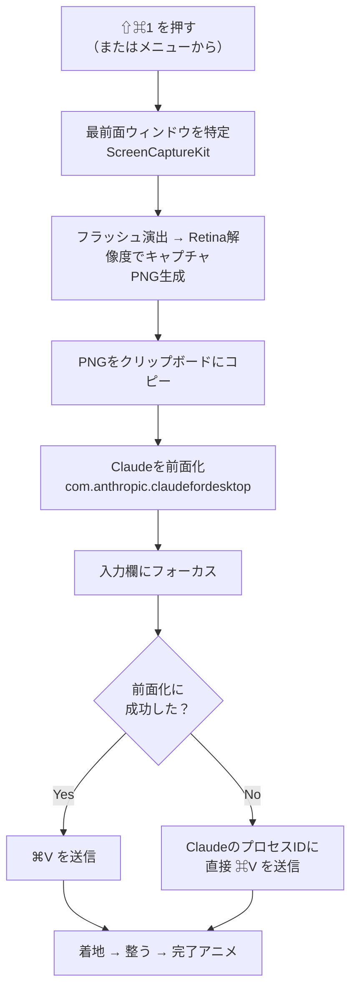

# Codexの「Appshot」が忘れられなくて、Claude用にゼロから作り直した話 — おまけで「動画をAIに読ませる」裏技も

## はじめに

ずっと地味に気に入っていた機能があります。Codexの **Appshot** です。

ショートカット一発で、いま見ているウィンドウをそのままAIに渡せる。スクショを撮って、保存先を探して、チャットにドラッグして……という一連の作業が丸ごと消える。使い始めるとこれが当たり前になって、無いと途端に面倒くさくなる。そういうタイプの機能でした。

で、最近メインをClaudeのデスクトップアプリに移したんですが、当然ながらAppshotはありません。Claude純正の機能ではないので。

毎回スクショを撮ってドラッグして貼る、という原始的な生活に戻ってしまい、これがどうにも我慢できませんでした。無いなら作るしかない。というわけで、**メニューバーに常駐して、ショートカット一発で最前面のウィンドウをキャプチャ → そのままClaudeの入力欄に貼り付ける**アプリを作りました。名前は **ClaudeShot** です。

リポジトリはこちら 👉 https://github.com/MohamedFuad16/ClaudeShot

> ⚠️ 先に断っておくと、これはAnthropic公式のツールではありません。個人が趣味で作った、Claudeデスクトップアプリの外付けヘルパーです。

---

## 何ができるのか

やることは驚くほどシンプルです。

1. どのアプリを使っていても **⇧⌘1**（デフォルト）を押す
2. 最前面のウィンドウが「パシャッ」とキャプチャされる（フラッシュ演出つき）
3. Claudeが前面に出てきて、入力欄にスクショが貼り付けられている

これだけです。手は一切動かさない。

*↑ ここに実際の動作GIFを入れる（ショートカットを押してから貼り付けまでの一連の流れ）*

メニューバーにはカメラのアイコンが常駐します。Dockには出てきません。完全に裏方です。

*↑ メニューバーのアイコンとドロップダウン*

---

## 設定まわり

「作り込みたくなる病」が発動して、設定画面もそれなりに用意しました。

- **ショートカットの変更** — プリセットから選ぶか、`ショートカットを記録…` を押して好きなキーの組み合わせを自分で登録できる（`Esc`でキャンセル）
- **キャプチャ音** — 撮影時に鳴らす音を選べる（オフも可）
- **フラッシュの速さ** — アニメーションのキレを「速い ⇄ 滑らか」で調整
- **日本語 / English** — UIはその場で切り替わる
- **権限まわり** — 画面収録とアクセシビリティの許可状態をその場で確認・付与

*↑ 設定画面（グラス調のUIにしてみた）*

デフォルトのショートカットは当初 **⇧⌘2** にしていたんですが、これは環境によって他の機能とぶつかりがちなので、**⇧⌘1** に変えました。とはいえ人によって空いてるキーは違うので、「好きなキーを自分で登録できる」機能を足したのが今回のポイントです。押したキーをそのまま読み取って登録します。

---

## いちばん苦労したところ：アニメーションの再現

ここが本題というか、個人的にいちばん楽しかった部分です。

ClaudeShotのキャプチャ演出は、**フラッシュ → 着地 → 整う → 完了** という4段階のアニメーションで動いています。これ、実はCodexのAppshotの「気持ちよさ」を再現したくて、かなり細かくチューニングしました。

問題は、**どうやって元のアニメーションのタイミングやイージングを知るか**です。

普通に考えたら、Codexの画面を録画して、それをそのままAIに見せて「これ再現して」とお願いしたい。……でも、ここで壁にぶつかります。

> **ClaudeもChatGPTも、動画をそのまま入力として受け取れません。** 受け付けてくれるのは基本的に画像だけです。

録画したmovファイルをそのまま投げても読んでくれない。じゃあどうするか。

そこで、**動画を「AIが読める形」に変換して食わせる小さな仕組み**を自作しました。ざっくり言うと、こういうことをやっています。

- 動画をフレーム単位でバラす（30/60/可変フレームレートに対応）
- 各フレームの正確なタイムスタンプを取り出す
- 隣り合うフレームの差分を取って「どこがいつ動いたか」を数値化する
- コンタクトシート（フレームを並べた一覧画像）にまとめる
- そこからイージングやタイミングを推定する

つまり、**動画そのものではなく「動画から抽出した画像と数値データ」をAIに渡す**わけです。これならClaudeは読めます。フレームの並びと差分を見せると、「最初の80msで一気に縮んで、そのあと240msかけてゆっくり整う」みたいな動きの構造をちゃんと言語化してくれて、それをSwiftUIに落とし込みました。

この「動画→フレーム＋タイミング解析→AIに読ませる」の仕組みそのものが、正直ClaudeShotより汎用的で面白いので、**これは別記事でちゃんと書きます。** ここでは「そういう裏技で元アニメを解析した」とだけ。

---

## 仕組み（全体の流れ）

内部でやっていることを図にすると、こんな感じです。

ポイントは最後の分岐です。macOS 14以降は「協調的アクティベーション（cooperative activation）」という仕組みのせいで、**バックグラウンドの常駐アプリから他のアプリを強制的に前面に持ってくるのが、けっこうな確率で拒否されます。** なので前面化に失敗しても、**Claudeのプロセスに直接 ⌘V を送る**フォールバックを用意しています。これで「見当違いのアプリに貼り付いてしまう」事故を防いでいます。

技術スタックはこんな感じ。

- **Swift / SwiftUI**（`MenuBarExtra` でメニューバー常駐）
- **ScreenCaptureKit**（ウィンドウキャプチャ）
- **Carbon**（グローバルショートカット）
- **Accessibility API**（Claudeの入力欄を探してフォーカス＆貼り付け）
- 外部依存ライブラリ **ゼロ**

---

## 現時点の課題（正直に2つ）

動いてはいるものの、まだ詰めきれていない問題が2つあります。隠さず書いておきます。

### 課題1：入力欄が未選択のままアプリを切り替えると、貼り付けに失敗することがある

**症状**：Claudeの入力欄をクリックしていない状態で、別のアプリからショートカットを叩くと、スクショは撮れるのに入力欄に貼られない、ということが起きます。

**理由**：貼り付け（⌘V）は「キーボードフォーカスのあるテキスト欄」に届いて初めて成立します。ところがClaudeデスクトップアプリはElectron（中身はChromium）製で、**アクセシビリティのツリーを必要になるまで遅延生成する**うえ、**プログラムからのフォーカス指定を無視することがよくあります。** そのため、こちらが「この入力欄にフォーカスして」と頼んでも空振りし、⌘Vが宙に浮いてしまう、というわけです。

**対策としてやっていること**：AX経由でウィンドウを前面に上げ、入力欄を座標から特定して**人間と同じように実クリックを合成**し、それでもダメなら**プロセスIDに直接⌘V**を送る、という多段構えにしています。だいぶマシにはなりましたが、まだ100%ではありません。ここは引き続き改善中です。

### 課題2：Claudeの「1メッセージ画像5枚まで」制限

**症状**：Claudeデスクトップアプリは、1メッセージにつき画像を**5枚まで**しか受け付けません。6枚目以降は、ClaudeShotはちゃんとキャプチャして画面右下にサムネイルも出すのですが、**入力欄には貼られず、クリップボードに入るだけ**になります。そこからは手動で⌘Vしてください、という挙動です。

**理由**：これはClaude側の仕様なので、こちらから枚数上限を突破することはできません。

**対策として考えていること**：枚数を数えて「そろそろ上限だよ」と知らせる、あるいは超過分をうまくハンドリングする、といった方向で対応予定です。ここも今後の課題。

---

## おわりに

というわけで、「無くなって困った機能を、自分で作り直した」という話でした。

Codexから移ってきて同じくAppshotロスに陥っている人がいたら、ぜひ試してみてください。ビルドは `./script/build_and_run.sh` 一発で、`.app`を作って署名して`/Applications`に入れて起動まで全部やってくれます（macOS 14以降とSwiftツールチェインが必要です）。

- **リポジトリ**： https://github.com/MohamedFuad16/ClaudeShot
- README は日本語 / English 両対応です

そして予告どおり、**「動画をAIに読ませる裏技」については近いうちに別記事で**詳しく書きます。個人的にはそっちのほうが応用が効くと思っているので、よかったらそちらもぜひ。

最後まで読んでいただきありがとうございました 🙏
