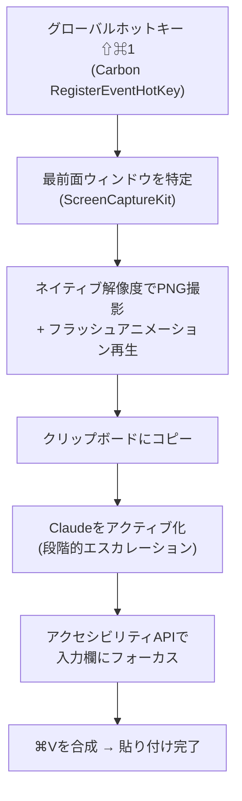

# Codexの神機能「Appshot」がClaudeに無かったので、⇧⌘1一発でスクショがClaudeに貼り付くmacOSアプリを自作した

<!-- Qiitaタグ案: macOS, Swift, ClaudeCode, Electron, 個人開発 -->

## はじめに

前回は、AndroidとiPhoneの間でAirDropっぽいファイル転送をブラウザだけで実現する話を書きました。

👉 [ブラウザだけでAirDropを再現したい — 超音波ペアリング×WebRTCで作って、Vercelに泣かされてAzureに移行した話](https://qiita.com/mfuad16/items/6ad8a06c395cb3e8f013)

今回はもっと小粒ですが、**毎日使うツール**の話です。

## Codexの「Appshot」という機能

OpenAIのCodexデスクトップアプリには、**Appshot**という機能があります。ショートカットを押すと最前面のウィンドウがパシャッと撮影されて、気持ちいいアニメーションと一緒にそのままCodexのチャット欄に貼り付く。それだけの機能です。

でも、これが**本当に手放せない**んです。

AIにUIの崩れを見せたいとき、エラーダイアログを見せたいとき、普通なら「スクショを撮る → Finderかクリップボード経由で貼る → チャットに戻る」という3ステップが要ります。Appshotならショートカット一発。思考が途切れません。

## Claudeに移行したら、無かった

最近、メインの開発環境をClaude(Claude Code + デスクトップアプリ)に移しました。概ね満足しているんですが、ひとつだけ困ったことが。

**Appshotが無い。**

Claudeのデスクトップアプリにはスクリーンショット取り込み機能はあるものの、「どこにいてもショートカット一発で最前面ウィンドウがチャット欄に飛んでいく」あの体験は再現されていません。毎回手で貼るたびに、指がAppshotを恋しがる。

無いなら、作ればいい。

## 作ったもの: ClaudeShot

というわけで作ったのが**ClaudeShot**です。メニューバーに常駐する小さなmacOSアプリで、Swift製・外部依存ゼロです。

📦 リポジトリ: https://github.com/MohamedFuad16/ClaudeShot

<!-- ここにGIF: ⇧⌘1を押してからClaudeに貼り付くまでの一連の流れ -->

できることはシンプルです。

- **⇧⌘1**（デフォルト。好きなキーに変更可）をMacのどこで押しても、最前面のウィンドウを撮影
- フラッシュ → 着地 → 完了のアニメーションを再生（Appshotの挙動を再現）
- 撮った画像をクリップボードにコピーしつつ、**Claudeを前面に出して⌘Vまで自動で押す**
- ショートカットはプリセットから選ぶほか、**録画ボタンを押して好きなキーの組み合わせをそのまま登録**できます
- UIは英語/日本語切り替え対応

<!-- ここに画像: 設定画面のスクリーンショット（ショートカット録画・サウンド・フラッシュ速度） -->

## 小ネタ: アニメーションはどうやって再現したか

Appshotの気持ちよさの半分はアニメーションです。ただ、困ったことに**ClaudeもChatGPTも動画を直接読めません**。受け取れるのは画像だけ。「この動画のアニメーションを再現して」ができないんです。

そこで、**動画をAIに読ませるためのスキル**を自作しました。Codexの画面録画をffmpegでフレーム単位に分解して、正確なタイムスタンプ・フレーム間の差分・モーションの数値化・キーフレーム抽出までやってメタデータ付きでAIに渡す仕組みです。これでAIが「0.45秒かけてease-outで縮む」みたいなレベルまでアニメーションを読み取れるようになります。

このスキルの話だけで1本書けるので、**詳しくは次回の記事で**書きます。

## 仕組み

全体の流れはこうなっています。

ポイントは後半の「Claudeに貼り付ける」部分で、ここが一番泥臭いです。

### アクティベーションの3段構え

macOS 14以降は**協調的アクティベーション**という仕組みになっていて、バックグラウンドのアプリが他のアプリを勝手に最前面へ持ってくることを、OSが基本的に拒否します。なのでClaudeShotは3段構えでエスカレーションします。

1. まず普通に `NSRunningApplication.activate()` でお願いする（だいたい断られる）
2. ダメならアクセシビリティAPIで `kAXFrontmostAttribute` を直接セットして、ウィンドウをRaise
3. それでもダメならLaunch Services経由で再オープン

### Electronの入力欄にフォーカスする

Claudeのデスクトップアプリは Electron(Chromium)製です。これが曲者で、ChromiumはアクセシビリティAPI経由のフォーカス指定を**平気で無視してきます**。

なのでClaudeShotは、AXツリーからチャット入力欄（ウィンドウ内で一番下にあるテキスト入力）を探し出して、AXフォーカスを試し、無視されたら**入力欄の中心座標を実際にマウスでクリックして**（その後カーソル位置は元に戻します）、人間と同じ方法でフォーカスを奪います。

ここまでやって、ようやく⌘Vが確実に届きます。

## Claude本体に組み込めないの?

「そもそもClaudeアプリのElectronを改造して、設定画面にこの機能を生やせばいいのでは?」と思って、実際に調べました。

結論: **現実的ではありません**でした。Claude.appのElectron Fuseを読んでみると、

- `EmbeddedAsarIntegrityValidation`: **有効**（app.asarのSHA-256ハッシュがInfo.plistに焼き込まれていて、起動時に検証される）
- `OnlyLoadAppFromAsar`: **有効**（asar以外からのコード読み込み不可）
- `RunAsNode` / `NodeOptions`: 無効（定番のコード注入経路も全部塞がれている）

つまりapp.asarを書き換えるとハッシュ不一致で起動しなくなり、ハッシュを書き換えるとコード署名が壊れ、再署名すると画面収録などのTCC許可が全部リセットされ、しかも**アップデートのたびに全部やり直し**。これは筋が悪い。

外付けのメニューバーアプリとして作るのが、結局いちばん正解でした。

## 既知の課題（正直に書きます）

現状、2つ課題があります。どちらも直す方向は見えています。

### 課